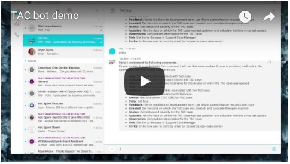

# TAC Bot

## Description

TAC Bot is a Spark Bot [ciscospark.com](http://www.ciscospark.com). Spark is a business messaging platform that supports persistent chat, voice and video calling, file sharing, and virtual whiteboards. The Spark platform is open and extensible through a rich set of APIs which the any Spark Bot, like *TAC Bot*, will use a webhook to receive all messages sent to the Bot, and will "listen" for a specific set of command words. When a command is received, it will perform an action based on the command.  Any other message sent to the bot will result in the help message being sent back.

It is intended to facilitate communications related to Cisco [TAC](http://www.cisco.com/go/tac) case management, including escalations communications, progress updates, next steps. It is not intended to replace traditional TAC tools such as email, file publishing, BE escalation requests, etc, but to enhance communications between TAC engineers, escalation teams, sales engineers, and the customer.

What is it intended to do?
* Enhance communication between individuals below
    * TAC Customer Support Engineers (CSE)
    * TAC Escalation Engineers
    * Account Team Systems Engineers
    * Advanced Services HTOMs & NCEs
    * PSTS (Post Sales Technical Support) Engineers
    * Customers
* Reduce case-related email clutter
* Shorten case duration through enhanced communication
* Increase customer satisfaction through enhanced communication and shorter case durations

What is it NOT intended to do?
* NOT intended to be a replacement for existing TAC tools:
    * Logged email communications
    * File publishing tools
    * BE escalation procedures
* NOT intended to be used to store customer-sensitive case data/configs

## Demo
[](https://youtu.be/61D02aYOP1U)

## How to use

You can use TAC Bot by simply inviting **tac@sparkbot.io** to your Spark room.

Or you can start a conversation with TAC bot by accessing the following URL.
```
# Remember to replace <EMAIL> with your email address
http://tac-bot.ecs.nerfherder.io/hello/<EMAIL>
```

**Note:** Due to the potentially sensitive nature of the data contained in a TAC case, TAC bot will only respond to requests for TAC case data if the request originates from a Cisco employee with a cisco.com email address. 

### Commands supported today

Most commands will accept a case number following the command and will return the data for that case number. If no case number is provided, the Bot will look in the name of the Spark room to which it is a part, and will use a case number if found there.

* **/title:** Get title for TAC case.
* **/description:** Get problem description for the TAC case.
* **/owner:** Get case owner (TAC CSE) for TAC case.
* **/contract:** Get contract number associated with the TAC case.
* **/customer:** Get customer contact info for the TAC case.
* **/status:** Get status and severity for the TAC case.
* **/rma:** Get list of RMAs associated with TAC case.
* **/bug:** Get list of Bugs associated with TAC case.
* **/device:** Get serial number and hostname for the device on which the TAC case was opened
* **/created:** Get the date on which the TAC case was created, and calculate the open duration
* **/updated:** Get the date on which the TAC case was last updated, and calculate the time since last update
* **/link:** Get link to the case in Support Case Manager
* **/feedback:** Sends feedback to development team; use this to submit feature requests and bugs
* **/help:** Get help.

### Automated room creation

TAC Bot has an API that can be used to create a room for a TAC case and invite a user. To use this API, create an HTTP GET call to the URL of the Bot for example:
```
# Be sure to replace <CASE#> and <EMAIL> with real values
http://tac-bot.ecs.nerfherder.io/create/<CASE#>/<EMAIL>
```
The plan is to use this API to automatically create these cases by sending an emails to an email service that will call this API. The project for the email service can be found at [github.com/imapex/tacbot-email](http://github.com/imapex/tacbot-email).

# Contribute

If you wish to contribute to TAC Bot, the instructions [here](contribute.md) should help to get a Bot running so that you can code, test and contribute.
